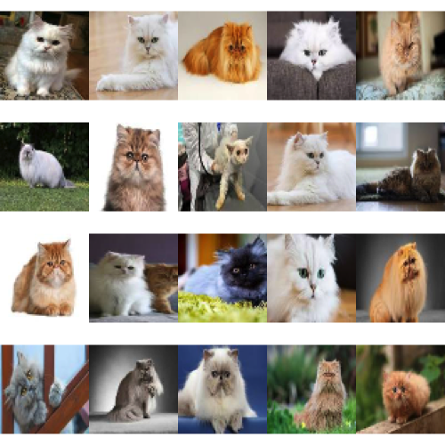

# [GoogleImage2Array (0.99.3)](https://kumes.github.io/GoogleImage2Array/)

[](https://cran.r-project.org/web/packages/GoogleImage2Array/index.html)
[](https://cran.r-project.org/web/packages/GoogleImage2Array/index.html)

R package for Creating Array Data from 2D Image Thumbnails via Google Image Search

[CRAN / GoogleImage2Array](https://cran.curtin.edu.au/web/packages/GoogleImage2Array/index.html)

Installation
======
```r
git clone https://github.com/kumeS/GoogleImage2Array
R CMD INSTALL GoogleImage2Array
```

or type the code below in the R console window

```r
install.packages("devtools", repos="http://cran.r-project.org")
library(devtools)
devtools::install_github("kumeS/GoogleImage2Array")
```

Usage 
======
```r
library(GoogleImage2Array)

#Search by persian cat
query <- "persian cat"
CatImg <- GoogleImage2array(query)

#show info
str(CatImg)
#$ array: num [1:20, 1:64, 1:64, 1:3] 0.0141 0.7029 0.7608 0.111 0.3398 ...
#$ query: chr "persian cat"

#show CatImg
display.array(CatImg)

#A example to bind arrays (ex. x and y) at the first dimension.
#unname(EBImage::abind(x, y, along=1))
```

Then, you should have the results of the tiled images.



# License
Copyright (c) 2021 Satoshi Kume 

Released under the [Artistic License 2.0](http://www.perlfoundation.org/artistic_license_2_0).

# Authors
- Satoshi Kume
